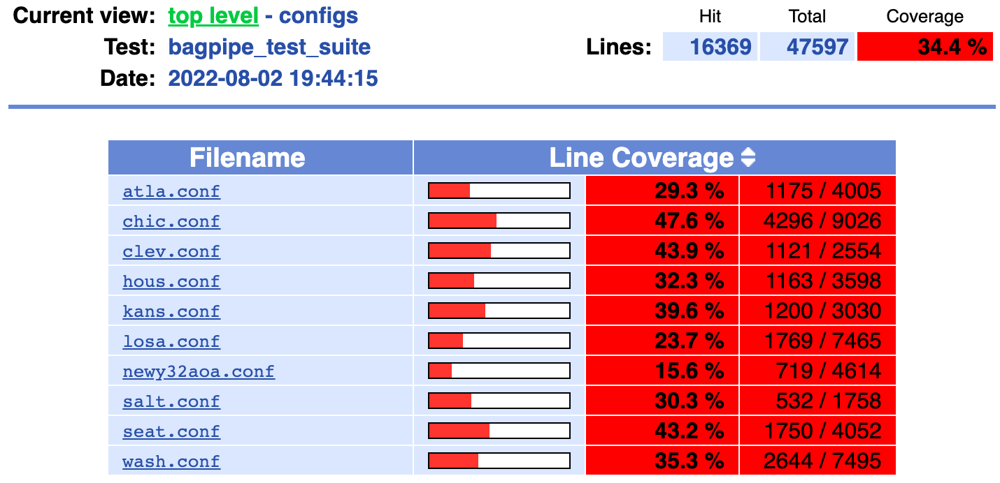
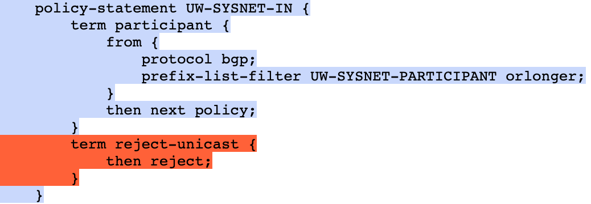

# NetCov
NetCov is an open-source tool that can be used with [Batfish](https://github.com/batfish/batfish) to analyze test coverage for network configurations. Given a set of Batfish queries, it analyzes which lines of configurations has/has not been covered. The result can be used to assess the rigorousness of the test suite and help discover the blind spots.


NetCov is written in Python and can be used in concert with [pybatfish](https://pybatfish.readthedocs.io/en/latest/notebooks/interacting.html), Batfish's Python API.


## Features

NetCov supports coverage tracking for the following [Batfish questions](https://pybatfish.readthedocs.io/en/latest/questions.html):

- Reachability test via [traceroute](https://pybatfish.readthedocs.io/en/latest/notebooks/forwarding.html#Traceroute) question
- Routing policy evaluation via [testRoutePolicies](https://pybatfish.readthedocs.io/en/latest/notebooks/routingProtocols.html#Test-Route-Policies) question
- Direct inspection of routing tables via [routes](https://pybatfish.readthedocs.io/en/latest/notebooks/routingTables.html#Routes) and [bgpRib](https://pybatfish.readthedocs.io/en/latest/notebooks/routingTables.html#BGP-RIB) questions


NetCov supports configuration formats of the following vendors:

- Cisco
- Juniper


NetCov reports configuration coverage as the percentage of configuration lines that are covered, such as:



NetCov can also report fine-grained coverage results as colored annotations on source configurations (lines in blue are covered, lines in red are not covered):



You can find an example of the coverage report [here](https://rawcdn.githack.com/UWNetworksLab/netcov/main/examples/fattree4/coverage/HTML_REPORT/index.html).


## Installing NetCov
Install NetCov using `pip`. A virtual environment and Python version 3.7 is recommended.
```sh
$ pip install netcov
```

NetCov leverages [LCOV](https://github.com/linux-test-project/lcov) to generate HTML report. If you would like to use this feature, install LCOV using Homebrew (MacOS) or apt (Ubuntu):

Install `lcov` on MacOS using Homebrew:
```sh
$ brew install lcov
```
Install `lcov` on Ubuntu using apt:
```sh
$ sudo apt install lcov
```


## Usage
NetCov can be used seamlessly with `pybatfish`. It provides a hooked version of pybatfish APIs that automatically tracks coverage during the execution of supported pybatfish questions. 

### Using NetCov for an existing pybatfish script/notebook

It takes only two simple steps to measure coverage for your existing pybatfish scripts/notebooks.

1. For import, replace pybatfish client session with the one provided by NetCov:
```python
#from pybatfish.client.session import Session
from netcov import NetCovSession as Session
```
2. Generate coverage results at the end of your script. To print coverage metrics to the console, use `bf.cov.result()`. To generate HTML report, use `bf.cov.html_report()`.

### Use NetCov for a new pybatfish script/notebook 

We provide a [demo video]() and an [example](examples/demo.ipynb) to help you get started. If you are new to pybatfish, we recommend reading the [pybatfish doc](https://pybatfish.readthedocs.io/en/latest/notebooks/interacting.html) first. 


### Advanced

Sometimes not all information retrieved by Batfish questions are meant to be tested, for example, when you retrieve all RIB entries but only assert on a subset of them. To help NetCov model coverage more accurately, you can pause coverage tracking and add tested information use a NetCov API:
```
# pause coverage tracking to avoid over-estimation
bf.cov.pause()
routes = bf.q.routes(nodes="edge-0000").answer().frame()
bf.cov.resume()

# filter RIB entries to test
tested = routes[routes["Network"] == '0.0.0.0/0'].head(1)

# add tested route to coverage trace
bf.cov.add_tested_routes(tested)
```

`bf.cov.result()` prints coverage metrics using `logging` module and writes to `stderr` by default. To save the coverage report to file, you can customize logger by:
```python
import logging
fh = logging.FileHandler('cov.log')
logging.getLogger('netcov').addHandler(fh)
```


